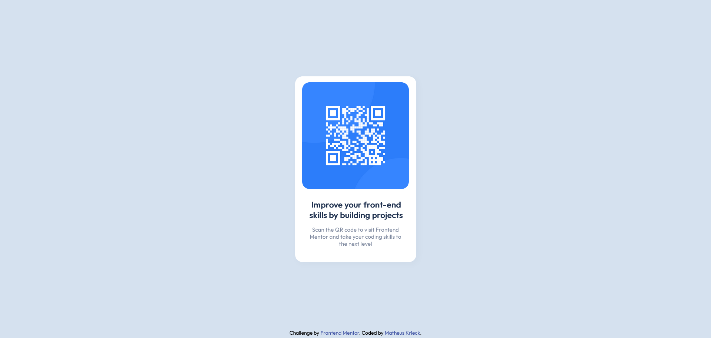

# Frontend Mentor - QR code component solution

This is a solution to the [QR code component challenge on Frontend Mentor](https://www.frontendmentor.io/challenges/qr-code-component-iux_sIO_H). Frontend Mentor challenges help you improve your coding skills by building realistic projects. 

## Table of contents

- [Overview](#overview)
  - [Screenshot](#screenshot)
  - [Links](#links)
- [My process](#my-process)
  - [Built with](#built-with)
  - [What I learned](#what-i-learned)
  - [Useful resources](#useful-resources)
- [Author](#author)

## Overview

### Screenshot

### Links

- Solution URL: [Solution](https://your-solution-url.com)
- Live Site URL: [Live Site](https://your-live-site-url.com)

## My process

### Built with

- Semantic HTML5 markup
- Flexbox
- Mobile-first workflow

### What I learned

In this project I wanted to practice using Flexbox to align the contents of the page, and also was my first time following a figma design.

### Useful resources

- [CSS Flexbox](https://www.w3schools.com/css/css3_flexbox.asp) - CSS Flexbox w3schools.
- [Figma](https://www.figma.com) - Figma.

## Author

- Linkedin - [matheuskrieck](https://www.linkedin.com/in/matheuskrieck/)
- Frontend Mentor - [@matheuskrieck](https://www.frontendmentor.io/profile/matheuskrieck)
